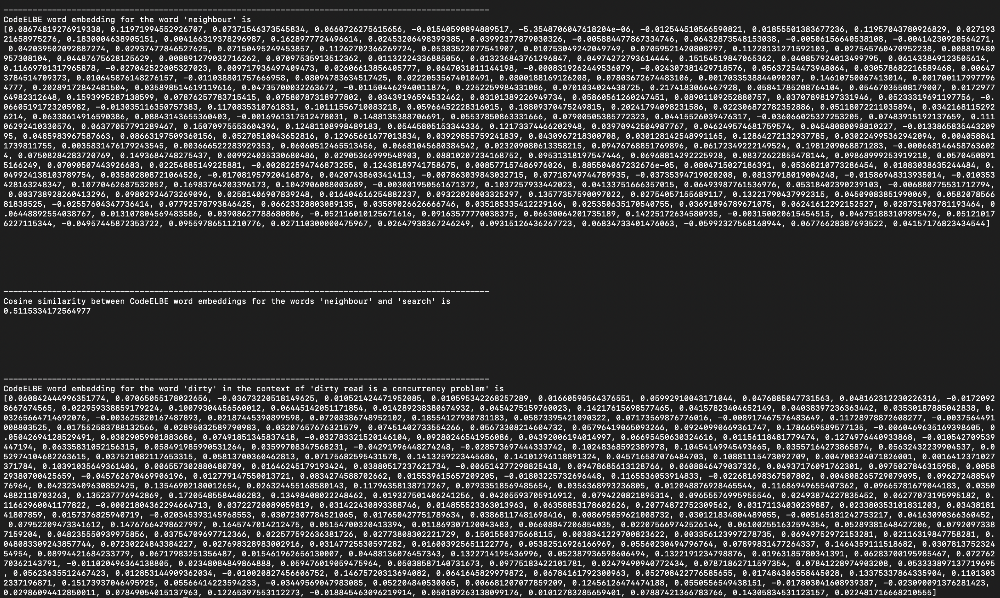

# CodeELBE

This repo contains the source code and embedding models for testing out CodeELBE embeddings presented in the paper: `An Effective Low-dimensional Software Code Representation using BERT and ELMo`


## Setting up the conda environment

To create the conda environment for running the scripts, enter the following command in the terminal from within the project's directory.
```
conda env create -f environment.yml
```
Once created successfully, you should be able to activate the environment using the following command

```
conda activate CodeELBE
```

## Downloading the embeddings models

In the project directory, create a folder named `checkpoints` . The embedding models need to be downloaded and placed in this newly created folder. To download the embedding models, please go to this [link](https://tinyurl.com/SWVECembeddings). From here, download the three folders named `CodeELBE_initial`, `CodeELBE_part1` and `CodeELBE_part2`

As mentioned earlier, place all these three embedding models in a folder named `checkpoints`  afer downloading them for the script to work. The project directory should like this

```
├── CodeELBE
├── project
│   ├── embeddings.py
│   ├── environment.yml
│   ├── checkpoints
│   │	├── CodeELBE_initial
│   │	├── CodeELBE_part1
│   │	├── CodeELBE_part2
```


## Trying out the embeddings

The file `embeddings.py` contains the code to load CodeELBE embeddings. It also has example snippets to generate the embeddings in different scenarios at the end. You can modify the tokens there to generate embeddings for your own tokens.  To run the file, enter the following commands from within the project directory

```
conda activate CodeELBE
python3 embeddings.py
```

You should see the embeddings and similarity score getting printed in the terminal as shown in this image




## Example usage

The example usage has been shown at the end of file ```embeddings.py```. The same has been explained here again for the ease of readers.

The CodeELBE embedding model is initialized using the following lines of code
```
embeddingmodel = CodeELBE_model()
embeddingmodel.load_all_CodeELBE_models()
```

You can use the following lines of code to generate the CodeELBE embeddings for a token ```w```

```
# e is the CodeELBE word embedding of word "w"
e = embeddingmodel.generate_final_CodeELBE_embeddings_word("w")
```

Similarly, you can use the following lines of code to generate the CodeELBE embeddings for a token ```w``` and a sentence ```s``` when ```w``` is used in the context of ```s```

```
# e1 is the CodeELBE sentence embedding of sentence "s"
# e2 is the CodeELBE word embedding of word "w"
e1,e2 = embeddingmodel.generate_final_CodeELBE_embeddings_sent("s","w")
```
